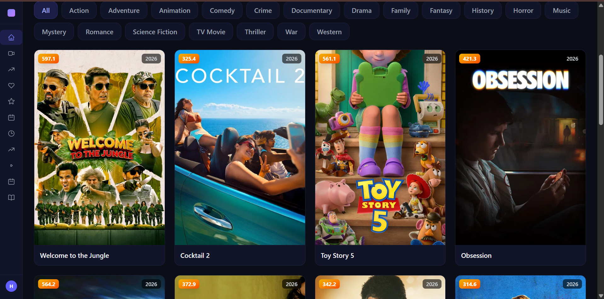
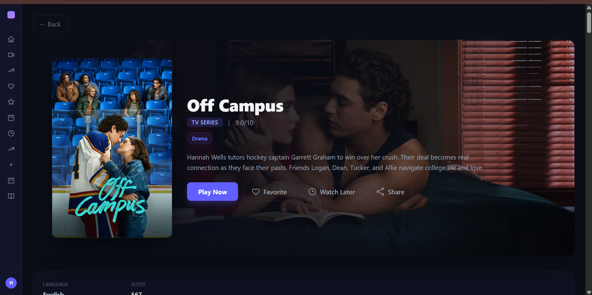
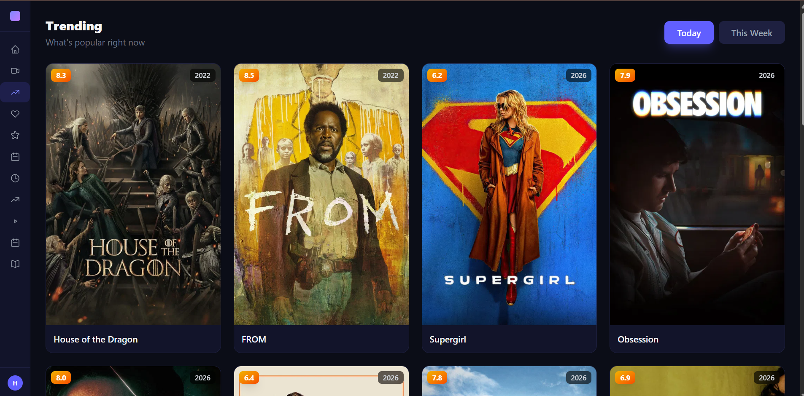
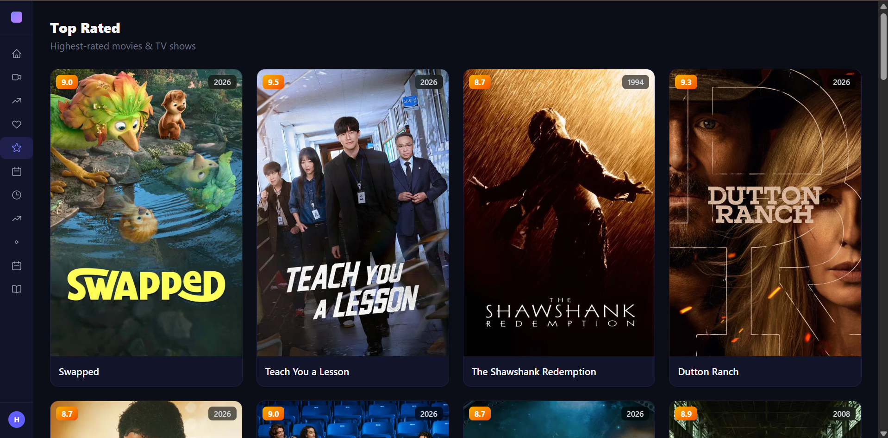
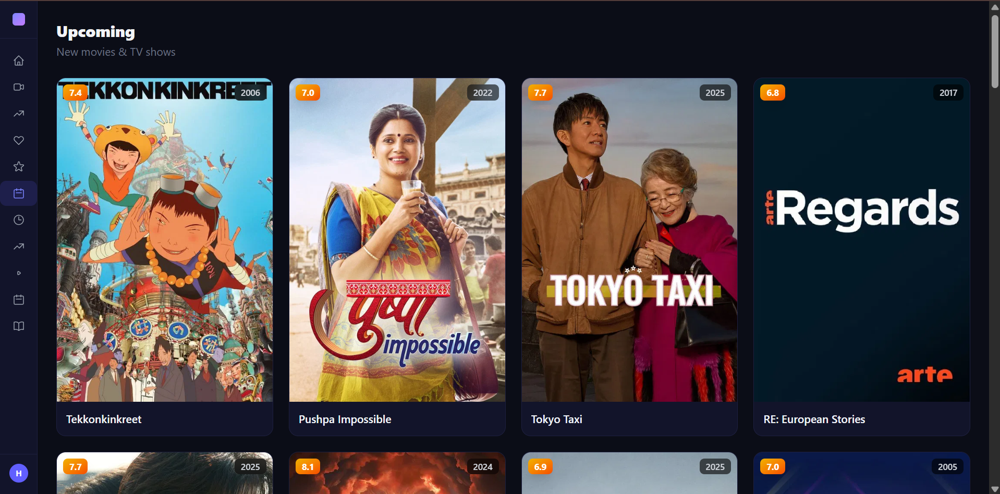
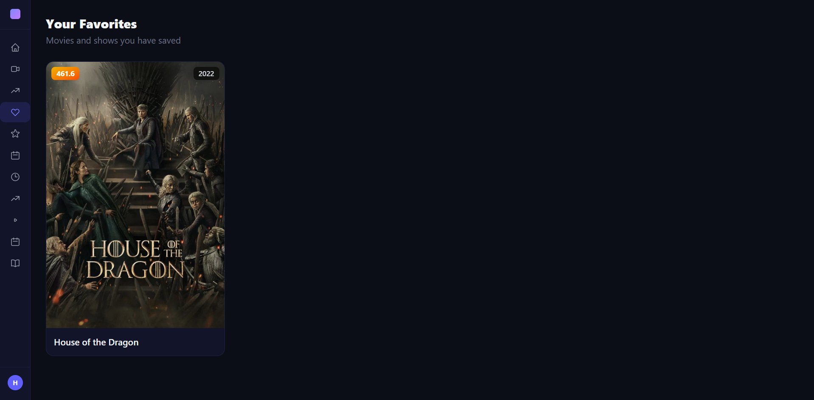
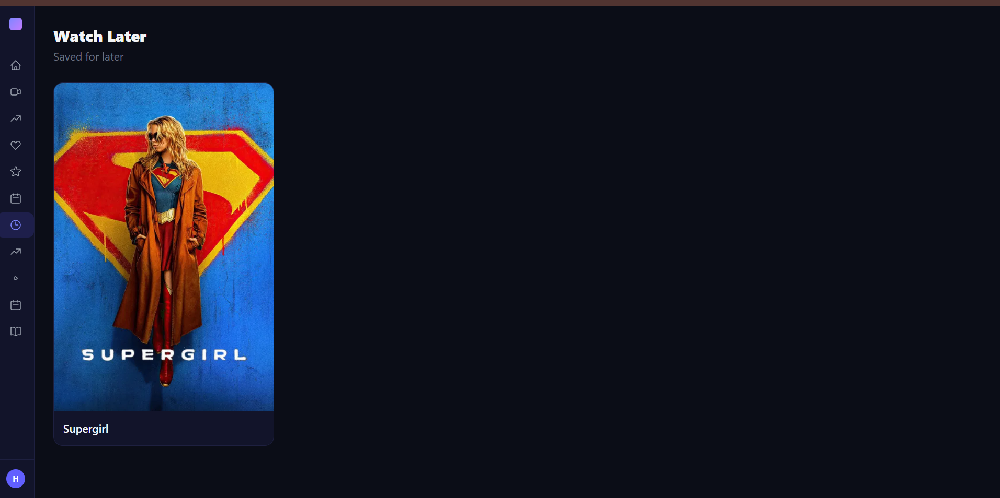
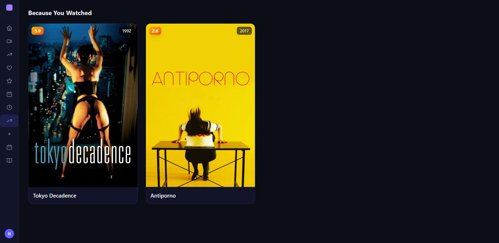
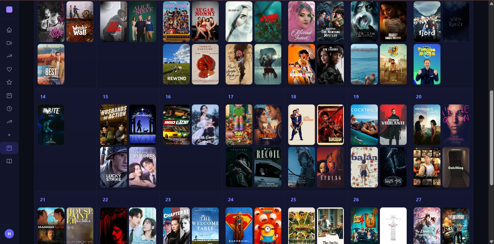
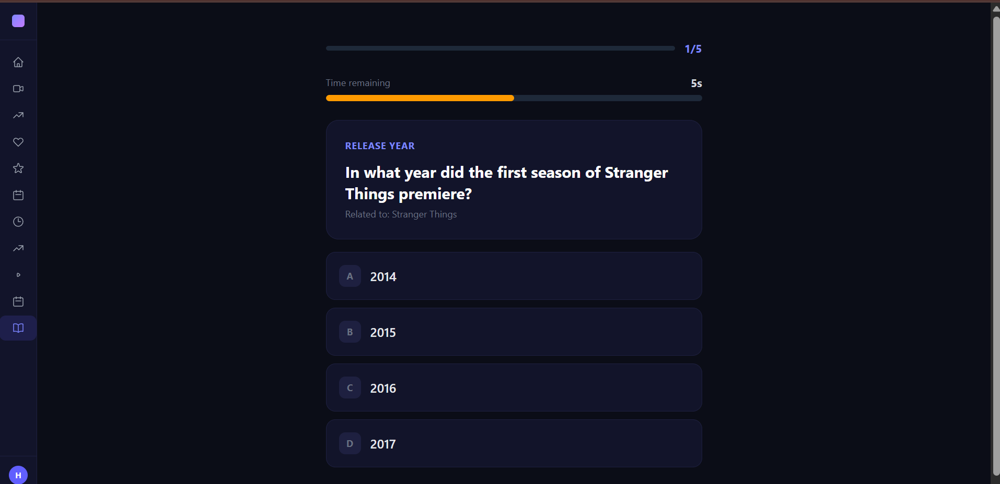

# 🎬 MovieSphere

A full-featured movie and TV streaming app with AI-powered recommendations, real-time watch parties, YouTube-powered reels, push notifications, and a weekly credit system.

## 🌐 Live Demo

- **Frontend**: https://movie-sphere-sigma.vercel.app
- **Backend API**: https://movie-sphere-backend.vercel.app
- **Updated**: June 28, 2026

---

## ✨ Features

### 📺 Media Library
- Browse **Now Playing**, **Popular**, **Top Rated**, **Upcoming**, **Trending** movies & TV shows
- Filter by **genre** (Action, Comedy, Drama, etc.) with TMDB genre IDs
- **Search** movies, TV shows, and people/actors
- **Detailed view** with cast, crew, recommendations, similar titles, trailers, and media gallery

### 🎥 Video Streaming
- Watch movies and TV episodes via embedded sources (SuperEmbed, VidLink, API.Player, VidBinge)
- **Cinema mode** with custom controls
- **Continue Watching** — progress tracked per user
- Episode/season selector for TV shows

### 🤖 AI Features
- AI-powered **movie recommendations** based on your taste
- **AI chat** about movies (powered by Groq / Llama 3.3 70B)
- **Daily trailer push notifications** with AI-generated descriptions
- **Daily Trivia Quiz** — 5 AI-generated movie/TV questions per session with 10-second timer. Earn +2 credits per correct answer

### 👥 Watch Party (LiveKit)
- Real-time **watch parties** with camera sharing
- Ephemeral chat via **LiveKit data channel**
- Create or join a party room
- QR code sharing for instant join

### 📱 Reels (YouTube Shorts)
- YouTube **Shorts-powered** reels feed
- Custom controls (no YouTube branding)
- Auto-play next reel

### 🎵 Music & GIFs
- Search **movie/TV show soundtracks** via iTunes Search API
- Browse/search **GIFs** via GIPHY API

### 🔐 Authentication
- **Email/password** signup & login
- **Google OAuth** via Supabase
- Auto token refresh on 401

### 📬 Push Notifications
- **Web push notifications** via VAPID (Service Worker)
- Up to **3 daily trailer notifications** with AI-generated text
- Staggered cron jobs (12:00, 16:00, 21:00 UTC)
- Force re-subscribe on every init

### ⚡ Credit System
- **100 free credits daily** (resets every day)
- Costs: 1 credit per API request, movies = 2 credits, TV episodes = 1 credit
- **402 blocked** when exhausted (full-page overlay)
- Exempt paths: credits, notifications, trailer digest, continue watching, comments, home page, OG previews

### 📂 Additional Features
- **Watch Later** list
- **Favorites** with heart toggle
- **Recently Viewed** history
- **User reviews & ratings** with comments
- **Account deletion**
- **Open Graph meta tags** for rich link previews on social media
- **Content Calendar** — monthly grid with poster thumbnails for upcoming movie/TV releases
- **Daily Trivia Quiz** — 5 AI-generated questions, 10-second timer, win credits

---

## 🏗 Tech Stack

### Backend
| Technology | Purpose |
|---|---|
| **Python 3.11+** | Runtime |
| **FastAPI** | Web framework |
| **Uvicorn** | ASGI server |
| **Supabase** | Database, Auth, REST API |
| **TMDB API** | Movie/TV metadata |
| **Groq AI** | AI-generated notification text |
| **LiveKit Cloud** | Watch party (WebRTC) |
| **YouTube Data API v3** | Reels & trailers |
| **GIPHY API** | GIF search |
| **iTunes Search API** | Soundtrack search |
| **pywebpush** | VAPID web push notifications |

### Frontend
| Technology | Purpose |
|---|---|
| **React 19** | UI framework |
| **Vite** | Build tool |
| **React Router v7** | Client-side routing |
| **Axios** | HTTP client |
| **Tailwind CSS v4** | Styling |
| **@supabase/supabase-js** | Supabase client (OAuth) |
| **livekit-client** | Watch party WebRTC |
| **@tanstack/react-query** | Data fetching |

### Deployment
| Service | Purpose |
|---|---|
| **Vercel** | Frontend hosting (SPA) + Backend hosting |
| **Supabase** | Database, Auth, Storage |
| **LiveKit Cloud** | WebRTC infrastructure |
| **cron-job.org** | Scheduled push notification jobs |

---

## 📋 Prerequisites

- **Python 3.11+**
- **Node.js 18+**
- **A Supabase project** (database + auth)
- **TMDB API key** (free)
- **LiveKit Cloud** account (free tier available)
- **YouTube Data API v3** key
- **Groq API key** (free tier available)
- **GIPHY API key** (free tier, 1K req/day)
- **VAPID keys** for web push notifications

---

## 🛠 Setup

### 1. Clone the repository

```bash
git clone https://github.com/yourusername/MovieSphere.git
cd MovieSphere
```

### 2. Backend Setup

```bash
cd MovieSphere_backend

# Create virtual environment
python -m venv venv
# Windows
venv\Scripts\activate
# Mac/Linux
source venv/bin/activate

# Install dependencies
pip install -r requirements.txt

# Copy and fill environment variables
cp .env.example .env
```

**.env variables:**

```env
tmdb_api_key=your_tmdb_api_key
groq_api_key=your_groq_api_key
project_url=https://your-project.supabase.co
api_key=your_supabase_service_role_key
anon_key=your_supabase_anon_key
LIVEKIT_URL=wss://your-instance.livekit.cloud
LIVEKIT_API_KEY=your_livekit_api_key
LIVEKIT_API_SECRET=your_livekit_api_secret
YOUTUBE_API_KEY=your_youtube_api_key
GIPHY_API_KEY=your_giphy_api_key
CRON_SECRET_KEY=your_cron_secret
VAPID_PUBLIC_KEY=your_vapid_public_key
VAPID_PRIVATE_KEY=your_vapid_private_key
```

**Run the backend:**

```bash
uvicorn app.main:app --reload --port 8000
```

The API is available at `http://localhost:8000`.

### 3. Frontend Setup

```bash
cd frontend

# Install dependencies
npm install

# Create .env file
echo "VITE_API_URL=http://localhost:8000" > .env
```

**Run the frontend dev server:**

```bash
npm run dev
```

The app is available at `http://localhost:5173`.

### 4. Database Setup (Supabase)

Create the required tables in your Supabase SQL editor:

```sql
-- user_credits
CREATE TABLE user_credits (
  id UUID DEFAULT gen_random_uuid() PRIMARY KEY,
  user_id UUID NOT NULL UNIQUE,
  free_credits INT DEFAULT 100,
  purchased_credits INT DEFAULT 0,
  created_at TIMESTAMPTZ DEFAULT NOW(),
  updated_at TIMESTAMPTZ DEFAULT NOW()
);

-- user_notifications (push subscriptions)
CREATE TABLE user_notifications (
  id UUID DEFAULT gen_random_uuid() PRIMARY KEY,
  user_id UUID NOT NULL,
  endpoint TEXT NOT NULL,
  p256dh_key TEXT NOT NULL,
  auth_key TEXT NOT NULL,
  created_at TIMESTAMPTZ DEFAULT NOW()
);

-- daily_trailers
CREATE TABLE daily_trailers (
  id UUID DEFAULT gen_random_uuid() PRIMARY KEY,
  media_id INT NOT NULL,
  media_type TEXT NOT NULL,
  title TEXT,
  poster_url TEXT,
  created_at TIMESTAMPTZ DEFAULT NOW(),
  sent BOOLEAN DEFAULT FALSE
);

-- user_favorites
CREATE TABLE user_favorites (
  id UUID DEFAULT gen_random_uuid() PRIMARY KEY,
  user_id UUID NOT NULL,
  title TEXT NOT NULL,
  media_type TEXT,
  created_at TIMESTAMPTZ DEFAULT NOW()
);

-- continue_watching
CREATE TABLE continue_watching (
  id UUID DEFAULT gen_random_uuid() PRIMARY KEY,
  user_id UUID NOT NULL,
  media_id INT NOT NULL,
  media_type TEXT,
  season INT,
  episode INT,
  progress_seconds FLOAT DEFAULT 0,
  total_seconds FLOAT DEFAULT 0,
  title TEXT,
  poster_url TEXT,
  updated_at TIMESTAMPTZ DEFAULT NOW()
);

-- comments
CREATE TABLE comments (
  id UUID DEFAULT gen_random_uuid() PRIMARY KEY,
  user_id UUID NOT NULL,
  media_id INT NOT NULL,
  media_type TEXT,
  username TEXT,
  comment TEXT,
  rating INT,
  created_at TIMESTAMPTZ DEFAULT NOW()
);

-- user_exp (history)
CREATE TABLE user_exp (
  id UUID DEFAULT gen_random_uuid() PRIMARY KEY,
  user_id UUID NOT NULL,
  movie_id INT NOT NULL,
  media_type TEXT,
  created_at TIMESTAMPTZ DEFAULT NOW()
);

-- user_watch_later
CREATE TABLE user_watch_later (
  id UUID DEFAULT gen_random_uuid() PRIMARY KEY,
  user_id UUID NOT NULL,
  media_id INT NOT NULL,
  media_type TEXT,
  added_at TIMESTAMPTZ DEFAULT NOW()
);

-- user_recently_viewed
CREATE TABLE user_recently_viewed (
  id UUID DEFAULT gen_random_uuid() PRIMARY KEY,
  user_id UUID NOT NULL,
  media_id INT NOT NULL,
  media_type TEXT,
  title TEXT,
  poster_url TEXT,
  viewed_at TIMESTAMPTZ DEFAULT NOW()
);

-- watch_party_rooms
CREATE TABLE watch_party_rooms (
  id UUID DEFAULT gen_random_uuid() PRIMARY KEY,
  room_name TEXT NOT NULL,
  host_user_id UUID NOT NULL,
  media_id INT,
  media_type TEXT,
  is_active BOOLEAN DEFAULT TRUE,
  created_at TIMESTAMPTZ DEFAULT NOW()
);

-- daily_trivia (cached questions — optional, AI generates on-the-fly by default)
CREATE TABLE IF NOT EXISTS daily_trivia (
  id SERIAL PRIMARY KEY,
  quiz_date DATE NOT NULL DEFAULT CURRENT_DATE,
  questions JSONB NOT NULL,
  created_at TIMESTAMPTZ DEFAULT NOW()
);
CREATE UNIQUE INDEX IF NOT EXISTS idx_trivia_date ON daily_trivia(quiz_date);

-- user_trivia_scores
CREATE TABLE IF NOT EXISTS user_trivia_scores (
  id SERIAL PRIMARY KEY,
  user_id UUID REFERENCES auth.users(id) NOT NULL,
  quiz_date DATE NOT NULL DEFAULT CURRENT_DATE,
  total_correct INTEGER DEFAULT 0,
  total_questions INTEGER DEFAULT 0,
  credits_earned INTEGER DEFAULT 0,
  created_at TIMESTAMPTZ DEFAULT NOW(),
  UNIQUE(user_id, quiz_date)
);

-- user_trivia_sessions (active per-user quiz session)
CREATE TABLE IF NOT EXISTS user_trivia_sessions (
  id SERIAL PRIMARY KEY,
  user_id UUID REFERENCES auth.users(id) NOT NULL UNIQUE,
  questions JSONB NOT NULL,
  created_at TIMESTAMPTZ DEFAULT NOW()
);
```

### 5. Set Up Push Notifications

Generate VAPID keys:

```bash
# Install web-push CLI
npm install -g web-push
web-push generate-vapid-keys
```

Add the keys to your `.env`:

```env
VAPID_PUBLIC_KEY=BA...
VAPID_PRIVATE_KEY=...
```

### 6. Configure Cron Jobs (cron-job.org)

Create 3 jobs hitting:

```
https://movie-sphere-backend.vercel.app/MovieSphere/trailer-digest/run?key=YOUR_CRON_SECRET_KEY
```

At times: `12:00`, `16:00`, `21:00` (UTC).

---

## 📁 Project Structure

```
MovieSphere/
├── MovieSphere_backend/          # Python FastAPI backend
│   ├── app/
│   │   ├── api/                  # Route handlers
│   │   │   ├── actors.py         # Actor/person detail
│   │   │   ├── ai.py             # AI recommendations & chat
│   │   │   ├── auth.py           # Auth endpoints (login, signup, refresh, Google, delete)
│   │   │   ├── cast.py           # Cast for movies/TV
│   │   │   ├── comments.py       # User reviews & comments
│   │   │   ├── continue_watching.py
│   │   │   ├── credits.py        # Credit balance
│   │   │   ├── details.py        # Movie/TV detail info
│   │   │   ├── favorites.py      # User favorites
│   │   │   ├── genres.py         # Genre list
│   │   │   ├── history.py        # User browsing history
│   │   │   ├── home.py           # Home page feed
│   │   │   ├── media.py          # Media gallery (images, videos)
│   │   │   ├── notifications.py  # Push subscription management
│   │   │   ├── og.py             # Open Graph HTML for social previews
│   │   │   ├── recommendations.py
│   │   │   ├── reels.py          # YouTube reels
│   │   │   ├── search.py         # Multi-search
│   │   │   ├── seasons.py        # Season episodes
│   │   │   ├── shows.py          # TV shows page
│   │   │   ├── stream.py         # Video streaming sources
│   │   │   ├── toprated.py       # Top rated
│   │   │   ├── trailer_digest.py # Push notification cron job
│   │   │   ├── trending.py       # Trending
│   │   │   ├── upcoming.py       # Upcoming
│   │   │   ├── watch_later.py    # Watch later list
│   │   │   ├── watch_party.py    # LiveKit watch party rooms
│   │   │   ├── daily_trivia.py   # Trivia quiz API
│   │   │   └── calendar.py       # Content calendar
│   │   ├── core/
│   │   │   ├── auth.py           # JWT auth dependency
│   │   │   ├── config.py         # Environment config
│   │   │   ├── credits.py        # Credit deduction logic
│   │   │   └── database.py       # Supabase client
│   │   ├── services/
│   │   │   ├── ai.py             # Groq AI integration
│   │   │   ├── giphy.py          # GIPHY API
│   │   │   ├── itunes.py         # iTunes Search API
│   │   │   ├── tmdb.py           # TMDB API wrapper
│   │   │   ├── trailer_digest.py # Push digest logic
│   │   │   ├── trivia.py         # AI trivia question generation
│   │   │   └── youtube.py        # YouTube Data API
│   │   ├── utils/
│   │   │   └── genres.py         # TMDB genre mappings
│   │   └── main.py               # FastAPI app entry + credit middleware
│   ├── requirements.txt
│   └── .env
│
├── frontend/                     # React Vite SPA
│   ├── public/
│   │   └── sw.js                 # Service Worker (push notifications)
│   ├── src/
│   │   ├── api/
│   │   │   ├── auth.js           # Auth API (login, signup, logout)
│   │   │   ├── client.js         # Axios instance + 401/402 interceptors
│   │   │   └── endpoints.js      # All API endpoint functions
│   │   ├── components/
│   │   │   ├── CastCard.jsx      # Cast member card
│   │   │   ├── GenreFilter.jsx   # Genre filter buttons
│   │   │   ├── GenreTag.jsx      # Individual genre tag
│   │   │   ├── HeroSection.jsx   # Hero banner
│   │   │   ├── MovieCard.jsx     # Movie/TV show card
│   │   │   ├── MovieGrid.jsx     # Grid layout of cards
│   │   │   ├── Pagination.jsx    # Page navigation
│   │   │   └── layout/           # Layout components (sidebar, topbar)
│   │   ├── context/
│   │   │   └── AuthContext.jsx   # Auth state provider
│   │   ├── hooks/
│   │   │   ├── useAuth.js        # Auth hook
│   │   │   ├── useCredits.js     # Credits fetcher
│   │   │   ├── useDebounce.js    # Debounce hook
│   │   │   ├── usePushNotifications.js  # Push subscription
│   │   │   └── useRecentlyViewed.js
│   │   ├── pages/
│   │   │   ├── ActorPage.jsx     # Person/actor detail
│   │   │   ├── AiPage.jsx        # AI recommendations
│   │   │   ├── AuthCallback.jsx  # Google OAuth callback
│   │   │   ├── AuthPage.jsx      # Login/Signup
│   │   │   ├── DetailPage.jsx    # Movie/TV detail
│   │   │   ├── FavoritesPage.jsx
│   │   │   ├── HomePage.jsx      # Main browse page
│   │   │   ├── RecommendPage.jsx
│   │   │   ├── ReelsPage.jsx     # YouTube Shorts
│   │   │   ├── SearchPage.jsx    # Search results
│   │   │   ├── ShowsPage.jsx     # TV shows page
│   │   │   ├── TopRatedPage.jsx
│   │   │   ├── TrendingPage.jsx
│   │   │   ├── UpcomingPage.jsx
│   │   │   ├── WatchLaterPage.jsx
│   │   │   ├── WatchPage.jsx     # Video player
│   │   │   ├── CalendarPage.jsx  # Content calendar
│   │   │   └── TriviaPage.jsx    # Daily trivia quiz
│   │   ├── App.jsx               # Routes + layout
│   │   └── main.jsx              # Entry point
│   ├── vercel.json               # Vercel deployment config
│   ├── vite.config.js
│   └── .env                      # VITE_API_URL
│
├── .gitignore
└── README.md
```

---

## 📡 API Endpoints

All API routes are prefixed with `/MovieSphere` (unless noted as `/auth`).

### Authentication (`/auth`)
| Method | Path | Description |
|---|---|---|
| POST | `/auth/signup` | Create account |
| POST | `/auth/login` | Sign in |
| POST | `/auth/logout` | Sign out |
| POST | `/auth/refresh` | Refresh access token |
| GET | `/auth/me` | Current user info |
| GET | `/auth/google/config` | Supabase OAuth config |
| DELETE | `/auth/account` | Delete account |

### Media Browsing
| Method | Path | Description |
|---|---|---|
| GET | `/MovieSphere/home/{page}` | Home page feed (genre filter via `?genre=`) |
| GET | `/MovieSphere/Shows/{page}` | TV shows feed (genre filter via `?genre=`) |
| GET | `/MovieSphere/search` | Multi-search (`?q=`) |
| GET | `/MovieSphere/genres` | Movie + TV genre lists |
| GET | `/MovieSphere/top-rated/{type}/{page}` | Top rated movies/TV |
| GET | `/MovieSphere/trending` | Trending all day/week |
| GET | `/MovieSphere/upcoming/{type}/{page}` | Upcoming movies/TV |

### Detail & Info
| Method | Path | Description |
|---|---|---|
| GET | `/MovieSphere/detail` | Movie/TV detail (`?title=&id=&type=`) |
| GET | `/MovieSphere/cast` | Cast list (`?title=&id=`) |
| GET | `/MovieSphere/recommendations` | Recommendations (`?title=`) |
| GET | `/MovieSphere/similar` | Similar titles (`?id=&type=`) |
| GET | `/MovieSphere/media` | Images & videos (`?id=&type=&title=`) |
| GET | `/MovieSphere/seasons` | Season episodes (`?tv_id=&season_number=`) |
| GET | `/MovieSphere/streamit` | Stream sources (`?id=&season=&epi=`) |
| GET | `/MovieSphere/actor/{id}` | Actor/person detail |

### User Actions
| Method | Path | Description |
|---|---|---|
| GET | `/MovieSphere/favs` | User favorites |
| POST | `/MovieSphere/add_fav` | Add favorite (`?name=`) |
| POST | `/MovieSphere/remove_fav` | Remove favorite (`?name=`) |
| GET | `/MovieSphere/watch-later` | Watch later list |
| POST | `/MovieSphere/watch-later/add` | Add to watch later |
| POST | `/MovieSphere/watch-later/remove` | Remove from watch later |
| GET | `/MovieSphere/continue-watching` | Continue watching list |
| PUT | `/MovieSphere/continue-watching/progress` | Save progress |
| GET | `/MovieSphere/comments` | Comments for media |
| POST | `/MovieSphere/comments` | Post comment |
| DELETE | `/MovieSphere/comments` | Delete comment |
| GET | `/MovieSphere/credits` | Credit balance |

### AI & Extras
| Method | Path | Description |
|---|---|---|
| POST | `/MovieSphere/ai/recommend` | AI recommendations |
| POST | `/MovieSphere/ai/chat` | AI chat about movies |
| GET | `/MovieSphere/reels` | YouTube reels |
| GET | `/MovieSphere/giphy` | GIF search (`?q=`) |
| GET | `/MovieSphere/music` | Soundtrack search (`?q=`) |
| POST | `/MovieSphere/watch-party/create` | Create watch party |
| POST | `/MovieSphere/watch-party/join` | Join watch party |
| POST | `/MovieSphere/watch-party/end` | End watch party |

### Push Notifications
| Method | Path | Description |
|---|---|---|
| POST | `/MovieSphere/notifications/subscribe` | Subscribe to push |
| GET | `/MovieSphere/trailer-digest/run` | Trigger trailer digest (cron) |

### Trivia Quiz
| Method | Path | Description |
|---|---|---|
| GET | `/MovieSphere/trivia/today` | Fetch fresh AI-generated quiz (5 questions) |
| POST | `/MovieSphere/trivia/submit` | Submit answers, earn credits for correct ones |

### Calendar
| Method | Path | Description |
|---|---|---|
| GET | `/MovieSphere/calendar` | Releases by month (`?month=&year=`) |

### Open Graph (Social Previews)
| Method | Path | Description |
|---|---|---|
| GET | `/MovieSphere/og/movie/{id}` | OG HTML for movie links |
| GET | `/MovieSphere/og/tv/{id}` | OG HTML for TV show links |

---

## 📸 Screenshots

| Home | TV Shows | Trending |
|:---:|:---:|:---:|
|  |  |  |

| Top Rated | Upcoming | Favorites |
|:---:|:---:|:---:|
|  |  |  |

| Watch Later | Recommendations | Calendar |
|:---:|:---:|:---:|
|  |  |  |

| Trivia Quiz |
|:---:|
|  |

---

## 🔄 Deployment

### Backend (Vercel)

The backend is a FastAPI app deployed as a Vercel Serverless Function.

```bash
cd MovieSphere_backend
# Vercel automatically detects the Python runtime
vercel --prod
```

Set all environment variables in Vercel project settings.

### Frontend (Vercel)

```bash
cd frontend
npm run build
vercel --prod
```

Set `VITE_API_URL` to the deployed backend URL.

---

## 💳 Credit System

| Action | Cost |
|---|---|
| Browsing any page (home, shows, search, etc.) | 1 credit |
| Streaming a movie | 2 credits |
| Streaming a TV episode | 1 credit |
| Trivia quiz (free to play), credits, notifications, trailer digest, continue watching, comments, home page load, OG previews | **Free** |
| Trivia correct answer (within 10s) | **+2 credits** |

- **100 credits** are allocated daily
- Reset occurs **every day** (checks if 1+ day has passed since `created_at`)
- When exhausted, the app shows a full-page blocked overlay
- Frontend auto-refreshes credits on every page navigation

---

## 🔔 Push Notifications

- Up to **3 trailer notifications** per day
- AI-generated title & body via Groq (`llama-3.3-70b-versatile`)
- Staggered cron jobs at 12:00, 16:00, 21:00 UTC
- Each notification links to `/detail/{media_type}/{media_id}`
- VAPID-based with `force re-subscribe` on every initialization

---

## 🎯 Social Sharing

Links like `https://movie-sphere-sigma.vercel.app/movie/1304313` show rich previews with poster, title, and description on WhatsApp, Facebook, Twitter, Telegram, etc. via server-rendered Open Graph meta tags. Real users are seamlessly redirected to the detail page.

---

## 🤝 Contributing

1. Fork the repository
2. Create a feature branch (`git checkout -b feature/amazing-feature`)
3. Commit your changes (`git commit -m 'feat: add amazing feature'`)
4. Push to the branch (`git push origin feature/amazing-feature`)
5. Open a Pull Request

---

## 📄 License

This project is for educational and personal use. All media data is provided by TMDB, GIPHY, YouTube, and iTunes APIs. Video content is streamed from third-party embed sources.
